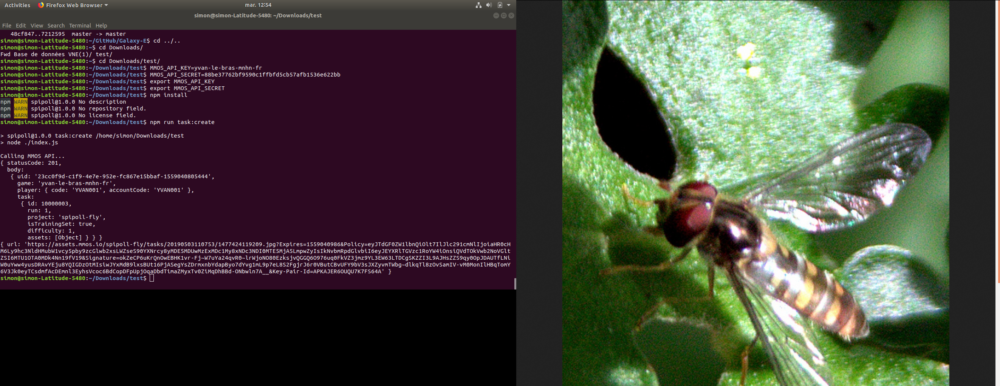

# GAPARS_Galaxy

## Galaxy-Bricks

Goal: Data literacy teaching activities
- Galaxy tools and workflows with associated teaching activities
- Wireframes
  - NGPhylogeny version https://xd.adobe.com/view/67f3b137-4f58-4349-5c51-de2cef02ca4d-11c2/grid
  - Scratch3 version https://xd.adobe.com/view/a762f0fb-00b9-490d-57e4-18e73ab60251-d153/
- Code
  - Scratch3 WIP https://github.com/yvanlebras/Scratch3Galaxy
  - NGPhylogeny planned for September 2020


## MOODA (Massive Open Online Data Analysis)

So I have a manner to interact with the MMOS portal through MMOS API and receive the URL of a bee picture that the user has to identify.

To do so, I am using 
- the MMOS API javascript sdk, 
- a index.js file (who contains connection informations, notably API key and associated password through 2 environment variables) 
- and a  package.json file (who contains needed dependencies to execute commands)

Then, executing
```
npm install
npm run task:create
```
I receive this stdout:
```
> spipoll@1.0.0 task:create C:\Users\ylebras\Documents\1_PNDB\2_Projets\H2020_GAPARS\SDK\test
> node ./index.js

Calling MMOS API...
{ statusCode: 201,
  body:
   { uid: '81e5fe2a-d6cc-45ca-8bf0-688dea7b0c47-1559059164041',
     game: 'yvan-le-bras-mnhn-fr',
     player: { code: 'YVAN001', accountCode: 'YVAN001' },
     task:
      { id: 10000101,
        run: 1,
        project: 'spipoll-fly',
        isTrainingSet: true,
        difficulty: 1,
        assets: [Object] } } }
{ url:
   'https://assets.mmos.io/spipoll-fly/tasks/20190503110753/1473621845158.jpg?Expires=1559059344&Policy=eyJTdGF0ZW1lbnQiOlt7IlJlc291cmNlIjoiaHR0cHM6Ly9hc3NldHMubW1vcy5pby9zcGlwb2xsLWZseS90YXNrcy8yMDE5MDUwMzExMDc1My8xNDczNjIxODQ1MTU4LmpwZyIsIkNvbmRpdGlvbiI6eyJEYXRlTGVzc1RoYW4iOnsiQVdTOkVwb2NoVGltZSI6MTU1OTA1OTM0NH19fV19&Signature=oaxkaZXmhFOpvBMBmndaz3yvIPKKrYAt2aG~TCgAM--bhZltR87Wm6MNYiKEVslCAvOcAqyUadmlOUmVswAfyKqsgsheSsN9MxWKLk4S7UvaruWBfz0fe9TSTSCJ1cxDeN7yU-FeWCbWNbb5PRXCme7~TTUWASM55Ek1Wp~RXUoQ8WESPEQuC~WipmnVKjKl9cmAe0EMlnEQ7HckTlacBvB1gzM-pDC8wf~hkKIsf~boOcMauwoZl8UvrWjfSwmPKF-xdipWuy9Le-e6ooy8o~lIWuESbozwrov9NQbZRADvyXvH-~LXMWKG9mwPZOrdUEfMh5I-VgXzHhYcY87U~g__&Key-Pair-Id=APKAJER6OUQU7K7FS64A' }
```
Where the URL allows to download the picture and display it

So idea is to use this on 2 different manners:

- first, to display a randomizely selected picture of bee once a galaxy user submitted a job using webhook functionality in the same spirit than you made with PhDcomics
- second, to import a picture into a Galaxy history, so the user can use bioimaging tools inside Galaxy to treat / analyse the picture and send the results back to MMOS. Here we will use a "classical Galaxy tool" to get picture and another one to send analysis results

For now, I have to use the code with these command lines (to use the index.js file so the "task:create" function:
```
npm install;
npm run task:create
```
and I receive this kind of answer



The next step will be to make similar work to allow the Galaxy user to send its task answer to MMOS through the MMOS API api.classifications.create function. Here we are working on the index.js.classification file

This assumes you have saved the create task timestamp in task.created, and that the result variable corresponds to it's validation schema (attached), essentially, your result variable should be one of the following: ["female", "likelyFemale", "cantSee", "likelyMale", "male"]
Please note it's case sensitive.


So the idea is :
- using the "task:create" function (through index.js), Galaxy can display a bee picture
- the user has to clic on one of the answer possibilities ("female", "likelyFemale", "cantSee", "likelyMale", "male"), the selected answer is stored in task.created.
- the "classification" funtion is "called" (through index.js.classification) and give the answer, for example "female", to MMOS portal.
